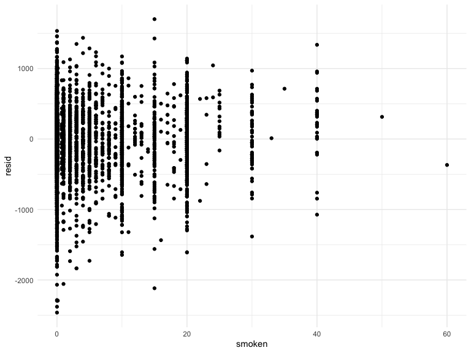
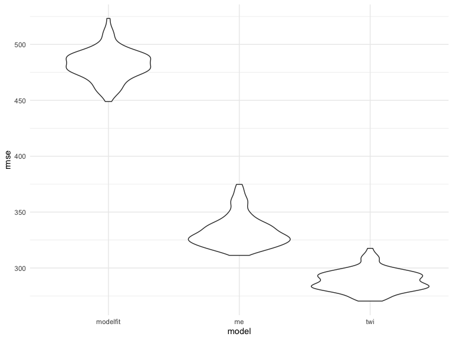
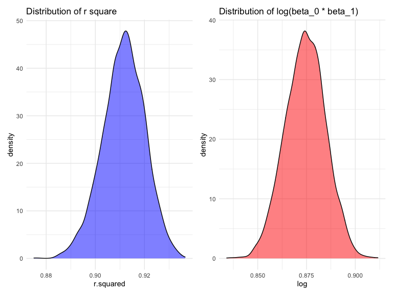

Homework 6
================
Zhongqi Yue

### Due date

Due: December 4 at 10:00pm.

### Points

  - Problem 0: 20 points
  - Problem 1: – points
  - Problem 2: 40 points
  - Problem 3: 40 points

### Problem 0

This “problem” focuses on structure of your assignment, including the
use of R Markdown to write reproducible reports, the use of R Projects
to organize your work, the use of relative paths to load data, and the
naming structure for your files.

To that end:

  - create a public GitHub repo + local R Project for this assignment
  - write solutions using a .Rmd file that outputs a `github_document` /
    .md file
  - submit a link to your repo via Courseworks

Your solutions to Problems 1 and 2 should be implemented in your .Rmd
file, and your git commit history should reflect the process you used to
solve these Problems.

For Problem 0, we will assess adherence to the instructions above
regarding repo structure, git commit history, and whether we are able to
knit your .Rmd to ensure that your work is reproducible. Adherence to
appropriate styling and clarity of code will be assessed in Problems 1+
using the homework [style rubric](homework_style_rubric.html).

This homework includes figures; the readability of your embedded plots
(e.g. font sizes, axis labels, titles) will be assessed in Problems 1+.

``` r
library(tidyverse)
library(modelr)
library(patchwork)
library(p8105.datasets)
```

### Problem 1

``` r
homicide_df = 
  read_csv("data/homicide-data.csv", na = c("", "NA", "Unknown")) %>% 
  mutate(
    city_state = str_c(city, state, sep = ", "),
    victim_age = as.numeric(victim_age),
    resolution = case_when(
      disposition == "Closed without arrest" ~ 0,
      disposition == "Open/No arrest"        ~ 0,
      disposition == "Closed by arrest"      ~ 1)
  ) %>% 
  filter(
    victim_race %in% c("White", "Black"),
    city_state != "Tulsa, AL") %>% 
  select(city_state, resolution, victim_age, victim_race, victim_sex)
```

    ## Parsed with column specification:
    ## cols(
    ##   uid = col_character(),
    ##   reported_date = col_double(),
    ##   victim_last = col_character(),
    ##   victim_first = col_character(),
    ##   victim_race = col_character(),
    ##   victim_age = col_double(),
    ##   victim_sex = col_character(),
    ##   city = col_character(),
    ##   state = col_character(),
    ##   lat = col_double(),
    ##   lon = col_double(),
    ##   disposition = col_character()
    ## )

Start with one city.

``` r
baltimore_df =
  homicide_df %>% 
  filter(city_state == "Baltimore, MD")

glm(resolution ~ victim_age + victim_race + victim_sex, 
    data = baltimore_df,
    family = binomial()) %>% 
  broom::tidy() %>% 
  mutate(
    OR = exp(estimate),
    CI_lower = exp(estimate - 1.96 * std.error),
    CI_upper = exp(estimate + 1.96 * std.error)
  ) %>% 
  select(term, OR, starts_with("CI")) %>% 
  knitr::kable(digits = 3)
```

| term              |    OR | CI\_lower | CI\_upper |
| :---------------- | ----: | --------: | --------: |
| (Intercept)       | 1.363 |     0.975 |     1.907 |
| victim\_age       | 0.993 |     0.987 |     1.000 |
| victim\_raceWhite | 2.320 |     1.648 |     3.268 |
| victim\_sexMale   | 0.426 |     0.325 |     0.558 |

Try this across cities.

``` r
models_results_df = 
  homicide_df %>% 
  nest(data = -city_state) %>% 
  mutate(
    models = 
      map(.x = data, ~glm(resolution ~ victim_age + victim_race + victim_sex, data = .x, family = binomial())),
    results = map(models, broom::tidy)
  ) %>% 
  select(city_state, results) %>% 
  unnest(results) %>% 
  mutate(
    OR = exp(estimate),
    CI_lower = exp(estimate - 1.96 * std.error),
    CI_upper = exp(estimate + 1.96 * std.error)
  ) %>% 
  select(city_state, term, OR, starts_with("CI")) 
```

``` r
models_results_df %>% 
  filter(term == "victim_sexMale") %>% 
  mutate(city_state = fct_reorder(city_state, OR)) %>% 
  ggplot(aes(x = city_state, y = OR)) + 
  geom_point() + 
  geom_errorbar(aes(ymin = CI_lower, ymax = CI_upper)) + 
  theme(axis.text.x = element_text(angle = 90, hjust = 1))
```


## Problem 2

Load and clean the data for regression analysis

``` r
# Tidy the raw dataset --- convert numeric to factor where appropriate
baby_df = 
  read_csv("./data/birthweight.csv") %>% 
  mutate(
    babysex = as.factor(babysex),
    frace = as.factor(frace),
    malform = as.factor(malform),
    mrace = as.factor(mrace)
    ) %>% 
  mutate(
    babysex = recode(babysex, "1" = "male", "2" = "female"),
    frace = recode(frace, "1" = "White", "2" = "Black", "3" = "Asian", "4" = "Puerto Rican", "8" = "Other", "9" = "Unknown"),
    malform = recode(malform, "1" = "present", "0" = "absent"),
    mrace = recode(mrace, "1" = "White", "2" = "Black", "3" = "Asian", "4" = "Puerto Rican", "8" = "Other")
         )
```

    ## Parsed with column specification:
    ## cols(
    ##   .default = col_double()
    ## )

    ## See spec(...) for full column specifications.

``` r
# Check for missing values
table_NA=
  baby_df %>% 
  summarise_all(funs(sum(is.na(.))))

t(table_NA) %>% 
  knitr::kable()
```

|          |   |
| :------- | -: |
| babysex  | 0 |
| bhead    | 0 |
| blength  | 0 |
| bwt      | 0 |
| delwt    | 0 |
| fincome  | 0 |
| frace    | 0 |
| gaweeks  | 0 |
| malform  | 0 |
| menarche | 0 |
| mheight  | 0 |
| momage   | 0 |
| mrace    | 0 |
| parity   | 0 |
| pnumlbw  | 0 |
| pnumsga  | 0 |
| ppbmi    | 0 |
| ppwt     | 0 |
| smoken   | 0 |
| wtgain   | 0 |

Fit a model

``` r
# Fit a model based on the combination of a data-driven model-building process and a hypothesized structure for the factors that underly birthweight. 
model_fit = 
  lm(bwt ~ smoken + factor(mrace), data = baby_df)
```

Show a plot of model residuals against fitted values

``` r
baby_df %>% 
  modelr::add_residuals(model_fit) %>% 
  modelr::add_predictions(model_fit) %>% 
  ggplot(aes(x = pred, y = resid)) + 
  geom_point() +
  labs(
    title = "Residual vs. fitted values",
    x = "Fitted values",
    y = "Residuals"
  )
```



Based on the Residual vs. Fitted values plot, we can see that the plot
has random pattern and almost evenly distributed around 0, which
suggests that the assumption that the relationship is linear is
reasonable. Additionally, residuals form a horizontal ‘band’ above and
below 0, which indicates the equal variance of the error terms.
Otherwise, there are almost no ‘unusual’ values stand out from the
random pattern, which indicates there might be no potential outliers.
Therefore, this model follow the assumption of the homoscedasticity.

Compare your model to two others:

  - One using length at birth and gestational age as predictors (main
    effects only)
  - One using head circumference, length, sex, and all interactions
    (including the three-way interaction) between these

<!-- end list -->

``` r
# Fit the models
me_mod = lm(bwt ~ blength + gaweeks, data = baby_df)
twi_mod = lm(bwt ~ bhead*blength*babysex, data = baby_df)
```

``` r
# Model comparison
## Make this comparison in terms of the cross-validated prediction error.
cv_df =
  crossv_mc(baby_df, 100) %>% 
  mutate(
    train = map(train, as_tibble),
    test = map(test, as_tibble))

## Next I’ll use mutate + map & map2 to fit models to training data and obtain corresponding RMSEs for the testing data.
cv_df = 
  cv_df %>% 
  mutate(
    model_fit  = map(train, ~lm(bwt ~ smoken + factor(mrace), data = .x)),
    me_mod     = map(train, ~lm(bwt ~ blength + gaweeks, data = .x)),
    twi_mod  = map(train, ~lm(bwt ~ bhead*blength*babysex, data = .x))) %>% 
  mutate(
    rmse_modelfit = map2_dbl(model_fit, test, ~rmse(model = .x, data = .y)),
    rmse_me    = map2_dbl(me_mod, test, ~rmse(model = .x, data = .y)),
    rmse_twi = map2_dbl(twi_mod, test, ~rmse(model = .x, data = .y)))

## Finally, I’ll plot the prediction error distribution for each candidate model.
cv_df %>% 
  select(starts_with("rmse")) %>% 
  pivot_longer(
    everything(),
    names_to = "model", 
    values_to = "rmse",
    names_prefix = "rmse_") %>% 
  mutate(model = fct_inorder(model)) %>% 
  ggplot(aes(x = model, y = rmse)) + geom_violin()
```



Based on the results, it is clear that the three-way interaction model
gains the best predictive accuracy even though it still has a small
portion of overlap with main effect model. However, my model has the
distinctly large prediction error, which indicates the multiple linear
model of the combination of ‘mrace’ and ‘smoken’ has the least
predictive accuracy.

# Problem 3

Load the data

``` r
weather_df = 
  rnoaa::meteo_pull_monitors(
    c("USW00094728"),
    var = c("PRCP", "TMIN", "TMAX"), 
    date_min = "2017-01-01",
    date_max = "2017-12-31") %>%
  mutate(
    name = recode(id, USW00094728 = "CentralPark_NY"),
    tmin = tmin / 10,
    tmax = tmax / 10) %>%
  select(name, id, everything())
```

    ## Registered S3 method overwritten by 'hoardr':
    ##   method           from
    ##   print.cache_info httr

    ## using cached file: /Users/yuezhongqi/Library/Caches/R/noaa_ghcnd/USW00094728.dly

    ## date created (size, mb): 2020-12-02 17:00:06 (7.531)

    ## file min/max dates: 1869-01-01 / 2020-11-30

Start to generate bootstrap samples

``` r
# Write a function to generate my bootstrap samples
boot_sample = function(df) {
  sample_frac(df, replace = TRUE)
}

# Use this function to generate 5000 bootstrap samples
boot_straps = 
  data_frame(
    strap_number = 1:5000,
    strap_sample = rerun(5000, boot_sample(weather_df))
  )

boot_straps
```

    ## # A tibble: 5,000 x 2
    ##    strap_number strap_sample      
    ##           <int> <list>            
    ##  1            1 <tibble [365 × 6]>
    ##  2            2 <tibble [365 × 6]>
    ##  3            3 <tibble [365 × 6]>
    ##  4            4 <tibble [365 × 6]>
    ##  5            5 <tibble [365 × 6]>
    ##  6            6 <tibble [365 × 6]>
    ##  7            7 <tibble [365 × 6]>
    ##  8            8 <tibble [365 × 6]>
    ##  9            9 <tibble [365 × 6]>
    ## 10           10 <tibble [365 × 6]>
    ## # … with 4,990 more rows

Analyzing bootstrap samples

``` r
# Generate two data frames to produce estimates of r square and log(beta0 * beta1)
rsquare_results = 
  boot_straps %>% 
  mutate(
    models = map(.x = strap_sample, ~lm(tmax ~ tmin, data = .x) ),
    results = map(models, broom::glance)) %>% 
  select(-strap_sample, -models) %>% 
  unnest(results) 

log_results = 
  boot_straps %>% 
  mutate(
    models = map(.x = strap_sample, ~lm(tmax ~ tmin, data = .x) ),
    results = map(models, broom::tidy)) %>% 
  select(-strap_sample, -models) %>% 
  unnest(results) 

# Calculate log(β̂ 0∗β̂ 1)from log_results
beta_0_df = 
  log_results %>% 
  filter(term == "(Intercept)") %>%
  rename(beta_0 = "estimate") %>% 
  select(strap_number, beta_0)

beta_1_df = 
  log_results %>% 
  filter(term == "tmin") %>%
  rename(beta_1 = "estimate") %>% 
  select( beta_1)

new_log_results = 
  bind_cols(beta_0_df, beta_1_df) %>% 
  mutate(log = log10(beta_0 * beta_1))

# Plot the distribution of the estimates for these two quantities
plot1 = 
  rsquare_results %>% 
  ggplot(aes(x = r.squared)) +
  geom_density(fill = "blue", alpha = 0.5) +
  labs(
    title = "Distribution of r square"
  )

plot2 = 
  new_log_results %>% 
  ggplot(aes(x = log)) +
  geom_density(fill = "red", alpha = 0.5) + 
  labs(
    title = "Distribution of log(beta_0 * beta_1)"
  )

# Combine two plots
(plot1 + plot2) + plot_layout(widths = 20, heights = 20)
```



The distributions of these two quantities seems to be normal distributed
since both of these two plots are in bell shape with only one peak.The
distribution of log seems to have smaller mu since its peak’s value on
the x-axis is smaller than that of the r squared distribution.
Additionally, the distribution of r square seems to have smaller sigma
value since its peak value on the y-axis is greater than that of the log
distribution.

Identify the 2.5% and 97.5% quantiles to provide a 95% confidence
interval for r̂^ 2 and log(β̂ 0∗β̂ 1).

``` r
# Provide a 95% confidence interval for r square
rsquare_results %>% 
  summarize(
    CI_lower = quantile(r.squared, 0.025), 
    CI_upper = quantile(r.squared, 0.975)) %>% 
  knitr::kable()
```

| CI\_lower | CI\_upper |
| --------: | --------: |
| 0.8935382 | 0.9276072 |

``` r
# Provide a 95% confidence interval for log(beta_0 * beta_1)
new_log_results %>% 
  summarize(
    CI_lower = quantile(log, 0.025), 
    CI_upper = quantile(log, 0.975)) %>% 
  knitr::kable()
```

| CI\_lower | CI\_upper |
| --------: | --------: |
| 0.8542708 | 0.8941712 |

  - The 95% confidence interval for r square is identified as
    (0.8935382, 0.9276072).
  - The 95% confidence interval for log(β̂ 0∗β̂ 1) is identified as
    (0.8542708, 0.8941712).
