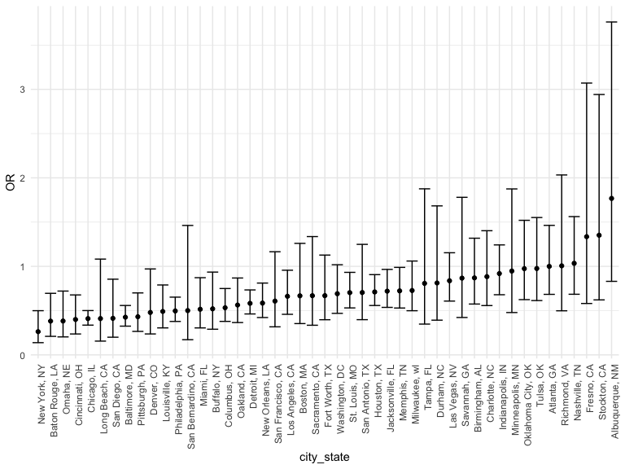
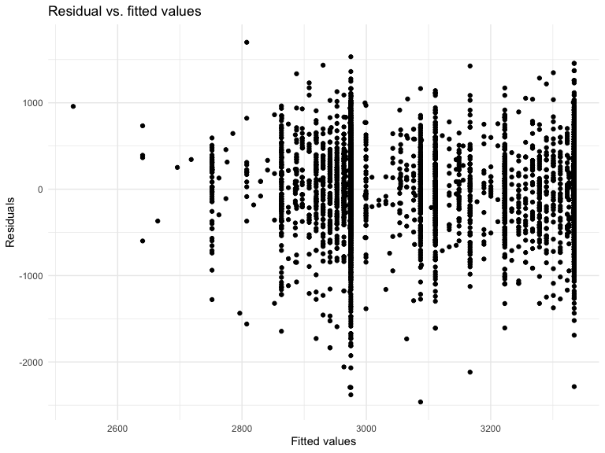
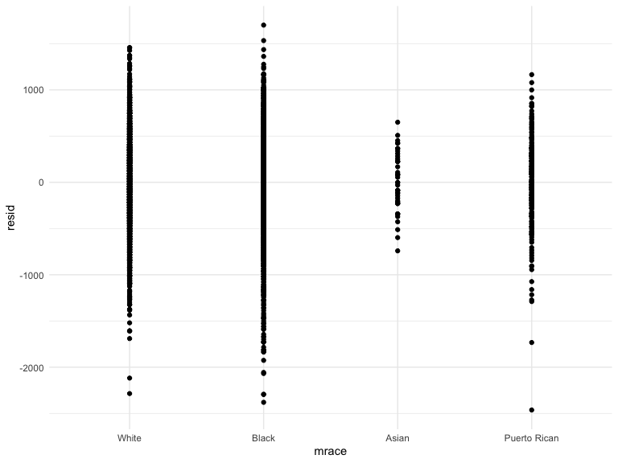
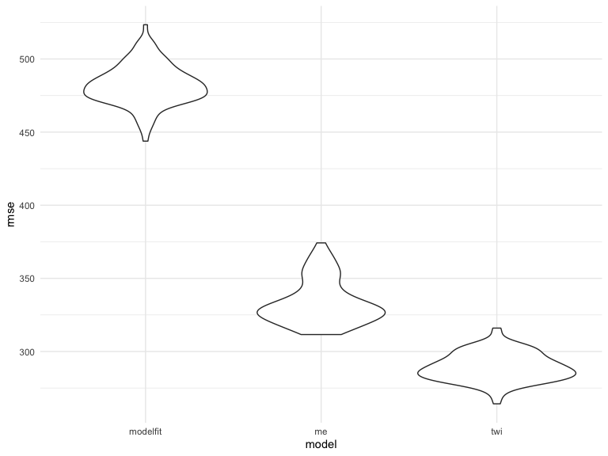

Homework 6
================
Zhongqi Yue

### Due date

Due: December 4 at 10:00pm.

### Points

  - Problem 0: 20 points
  - Problem 1: – points
  - Problem 2: 40 points
  - Problem 3: 40 points

### Problem 0

This “problem” focuses on structure of your assignment, including the
use of R Markdown to write reproducible reports, the use of R Projects
to organize your work, the use of relative paths to load data, and the
naming structure for your files.

To that end:

  - create a public GitHub repo + local R Project for this assignment
  - write solutions using a .Rmd file that outputs a `github_document` /
    .md file
  - submit a link to your repo via Courseworks

Your solutions to Problems 1 and 2 should be implemented in your .Rmd
file, and your git commit history should reflect the process you used to
solve these Problems.

For Problem 0, we will assess adherence to the instructions above
regarding repo structure, git commit history, and whether we are able to
knit your .Rmd to ensure that your work is reproducible. Adherence to
appropriate styling and clarity of code will be assessed in Problems 1+
using the homework [style rubric](homework_style_rubric.html).

This homework includes figures; the readability of your embedded plots
(e.g. font sizes, axis labels, titles) will be assessed in Problems 1+.

``` r
library(tidyverse)
library(modelr)
library(p8105.datasets)
```

### Problem 1

``` r
homicide_df = 
  read_csv("data/homicide-data.csv", na = c("", "NA", "Unknown")) %>% 
  mutate(
    city_state = str_c(city, state, sep = ", "),
    victim_age = as.numeric(victim_age),
    resolution = case_when(
      disposition == "Closed without arrest" ~ 0,
      disposition == "Open/No arrest"        ~ 0,
      disposition == "Closed by arrest"      ~ 1)
  ) %>% 
  filter(
    victim_race %in% c("White", "Black"),
    city_state != "Tulsa, AL") %>% 
  select(city_state, resolution, victim_age, victim_race, victim_sex)
```

    ## Parsed with column specification:
    ## cols(
    ##   uid = col_character(),
    ##   reported_date = col_double(),
    ##   victim_last = col_character(),
    ##   victim_first = col_character(),
    ##   victim_race = col_character(),
    ##   victim_age = col_double(),
    ##   victim_sex = col_character(),
    ##   city = col_character(),
    ##   state = col_character(),
    ##   lat = col_double(),
    ##   lon = col_double(),
    ##   disposition = col_character()
    ## )

Start with one city.

``` r
baltimore_df =
  homicide_df %>% 
  filter(city_state == "Baltimore, MD")

glm(resolution ~ victim_age + victim_race + victim_sex, 
    data = baltimore_df,
    family = binomial()) %>% 
  broom::tidy() %>% 
  mutate(
    OR = exp(estimate),
    CI_lower = exp(estimate - 1.96 * std.error),
    CI_upper = exp(estimate + 1.96 * std.error)
  ) %>% 
  select(term, OR, starts_with("CI")) %>% 
  knitr::kable(digits = 3)
```

| term              |    OR | CI\_lower | CI\_upper |
| :---------------- | ----: | --------: | --------: |
| (Intercept)       | 1.363 |     0.975 |     1.907 |
| victim\_age       | 0.993 |     0.987 |     1.000 |
| victim\_raceWhite | 2.320 |     1.648 |     3.268 |
| victim\_sexMale   | 0.426 |     0.325 |     0.558 |

Try this across cities.

``` r
models_results_df = 
  homicide_df %>% 
  nest(data = -city_state) %>% 
  mutate(
    models = 
      map(.x = data, ~glm(resolution ~ victim_age + victim_race + victim_sex, data = .x, family = binomial())),
    results = map(models, broom::tidy)
  ) %>% 
  select(city_state, results) %>% 
  unnest(results) %>% 
  mutate(
    OR = exp(estimate),
    CI_lower = exp(estimate - 1.96 * std.error),
    CI_upper = exp(estimate + 1.96 * std.error)
  ) %>% 
  select(city_state, term, OR, starts_with("CI")) 
```

``` r
models_results_df %>% 
  filter(term == "victim_sexMale") %>% 
  mutate(city_state = fct_reorder(city_state, OR)) %>% 
  ggplot(aes(x = city_state, y = OR)) + 
  geom_point() + 
  geom_errorbar(aes(ymin = CI_lower, ymax = CI_upper)) + 
  theme(axis.text.x = element_text(angle = 90, hjust = 1))
```



## Problem 2

Load and clean the data for regression analysis

``` r
# Tidy the raw dataset --- convert numeric to factor where appropriate
baby_df = 
  read_csv("./data/birthweight.csv") %>% 
  mutate(
    babysex = as.factor(babysex),
    frace = as.factor(frace),
    malform = as.factor(malform),
    mrace = as.factor(mrace)
    ) %>% 
  mutate(
    babysex = recode(babysex, "1" = "male", "2" = "female"),
    frace = recode(frace, "1" = "White", "2" = "Black", "3" = "Asian", "4" = "Puerto Rican", "8" = "Other", "9" = "Unknown"),
    malform = recode(malform, "1" = "present", "0" = "absent"),
    mrace = recode(mrace, "1" = "White", "2" = "Black", "3" = "Asian", "4" = "Puerto Rican", "8" = "Other")
         )
```

    ## Parsed with column specification:
    ## cols(
    ##   .default = col_double()
    ## )

    ## See spec(...) for full column specifications.

``` r
# Check for missing values
table_NA=
  baby_df %>% 
  summarise_all(funs(sum(is.na(.))))

t(table_NA) %>% 
  knitr::kable()
```

|          |   |
| :------- | -: |
| babysex  | 0 |
| bhead    | 0 |
| blength  | 0 |
| bwt      | 0 |
| delwt    | 0 |
| fincome  | 0 |
| frace    | 0 |
| gaweeks  | 0 |
| malform  | 0 |
| menarche | 0 |
| mheight  | 0 |
| momage   | 0 |
| mrace    | 0 |
| parity   | 0 |
| pnumlbw  | 0 |
| pnumsga  | 0 |
| ppbmi    | 0 |
| ppwt     | 0 |
| smoken   | 0 |
| wtgain   | 0 |

Fit a model

``` r
model_fit = 
  lm(bwt ~ mrace + smoken, data = baby_df)
```

Show a plot of model residuals against fitted values

``` r
smoken_plot = 
  baby_df %>% 
  modelr::add_residuals(model_fit) %>% 
  ggplot(aes(x = smoken, y = resid)) + 
  geom_point()

smoken_plot
```



``` r
mrace_plot = 
  baby_df %>% 
  modelr::add_residuals(model_fit) %>% 
  ggplot(aes(x = mrace, y = resid)) + 
  geom_point()

mrace_plot
```



Compare your model to two others:

  - One using length at birth and gestational age as predictors (main
    effects only)
  - One using head circumference, length, sex, and all interactions
    (including the three-way interaction) between these

<!-- end list -->

``` r
# Fit the models
me_mod = lm(bwt ~ blength + gaweeks, data = baby_df)
twi_mod = lm(bwt ~ bhead + blength + babysex, data = baby_df)
```

``` r
# Model comparison
## Make this comparison in terms of the cross-validated prediction error.
cv_df =
  crossv_mc(baby_df, 100) %>% 
  mutate(
    train = map(train, as_tibble),
    test = map(test, as_tibble))

## Next I’ll use mutate + map & map2 to fit models to training data and obtain corresponding RMSEs for the testing data.
cv_df = 
  cv_df %>% 
  mutate(
    model_fit  = map(train, ~lm(bwt ~ mrace + smoken, data = .x)),
    me_mod     = map(train, ~lm(bwt ~ blength + gaweeks, data = .x)),
    twi_mod  = map(train, ~lm(bwt ~ bhead + blength + babysex, data = .x))) %>% 
  mutate(
    rmse_modelfit = map2_dbl(model_fit, test, ~rmse(model = .x, data = .y)),
    rmse_me    = map2_dbl(me_mod, test, ~rmse(model = .x, data = .y)),
    rmse_twi = map2_dbl(twi_mod, test, ~rmse(model = .x, data = .y)))

## Finally, I’ll plot the prediction error distribution for each candidate model.
cv_df %>% 
  select(starts_with("rmse")) %>% 
  pivot_longer(
    everything(),
    names_to = "model", 
    values_to = "rmse",
    names_prefix = "rmse_") %>% 
  mutate(model = fct_inorder(model)) %>% 
  ggplot(aes(x = model, y = rmse)) + geom_violin()
```



  - Based on the results, it is clear that the three-way interaction
    model gains the best predictive accuracy even though it still has a
    small portion of overlap with main effect model.
